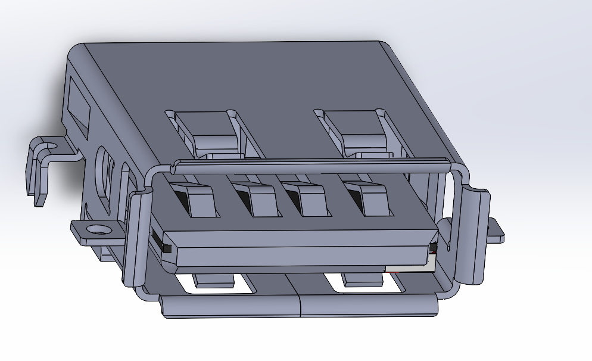
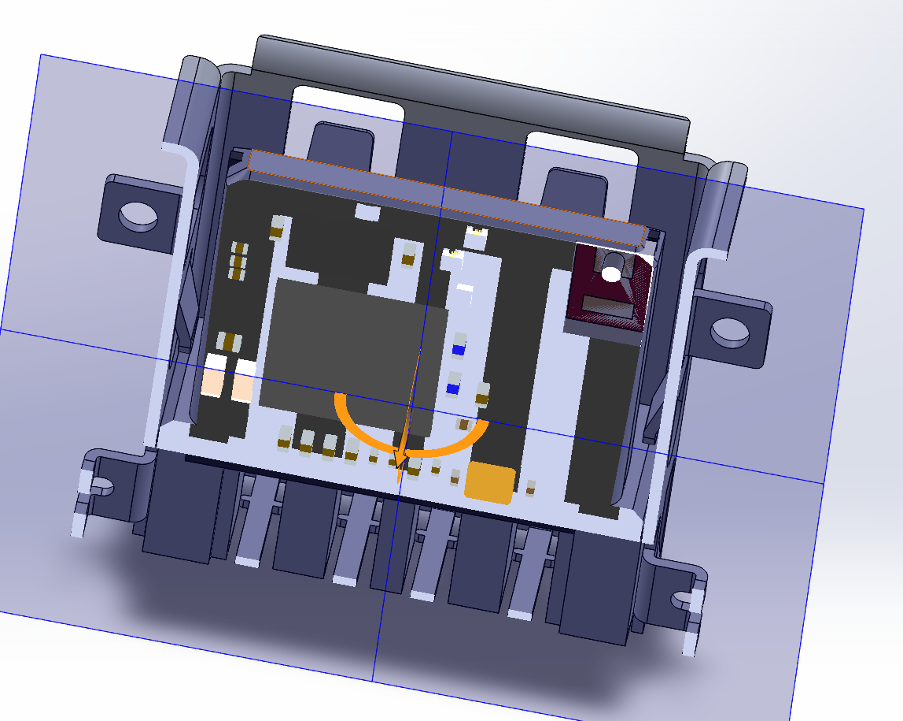
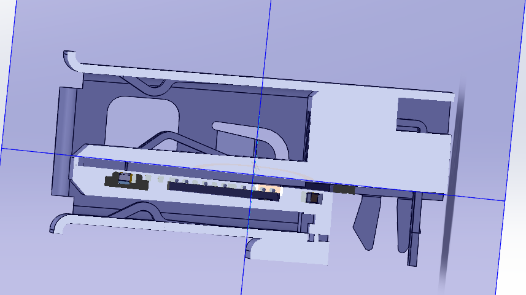
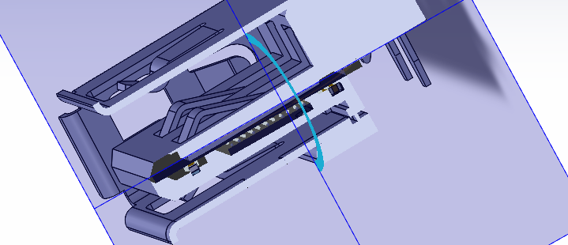
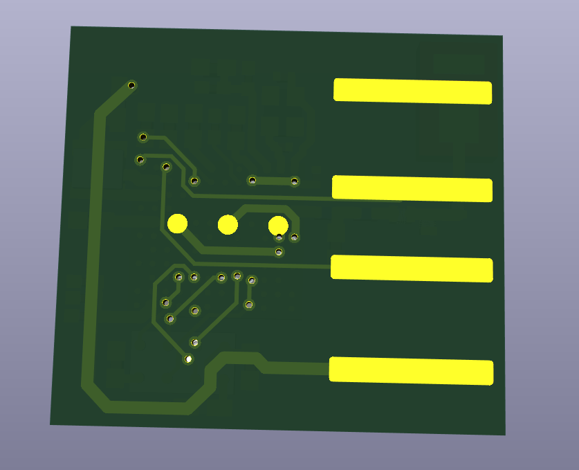

# COTTONMOUTH-IV

A true in USB device capable of extracting and transmitting data from target devices. It is placed within the lip of a standard Molex USB port using various production techniques. The USB port of the target device can then be replaced to contain COTTONMOUTH‑IV. It is 2.4 GHz based, using custom RF or BLE, and offers over‑the‑air update capabilities.

It uses the new NRF54LM20A paired with an nRF21540 front‑end module, extending the range of the system and helping in the high‑interference environment. It is connected to a NN02‑101 antenna. It also contains a 32‑Mbit M95P32 EEPROM for additional storage. In total, the board measures 11 × 10 mm.

## Production

WIP

### PCB Manufacturing

0.4mm thick.

### Embedding

-

## Programming

WIP

## Weaponisation

WIP
